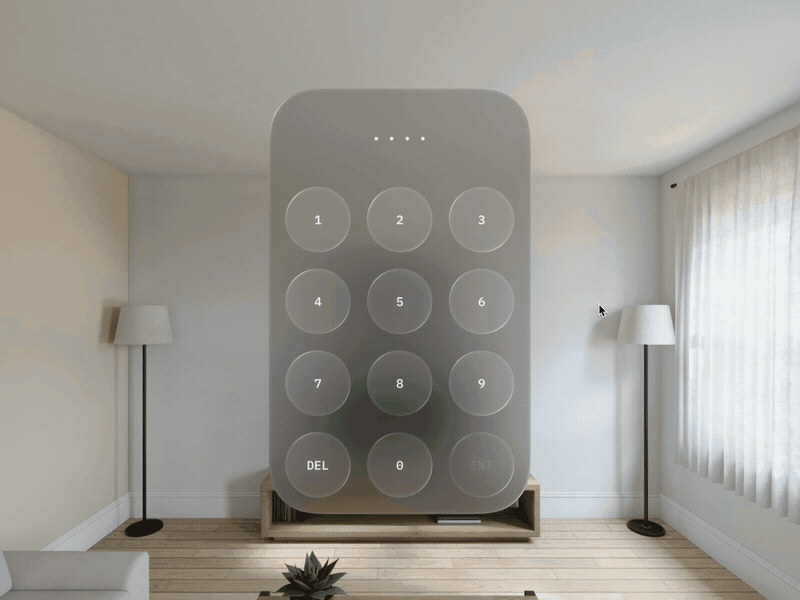

# VisionOS prototypes with SwiftUI

A collection of interactive prototypes for VisionOS made with SwiftUI and RealityKit.

- [Keypad That Remembers](#keypad-that-remembers)
- [Switcher III](#switcher-iii)
- [Switcher II](#switcher-ii)
- [Switcher I](#switcher-i)

## Keypad That Remembers

[Learn more](https://twitter.com/Volorf/status/1749352297081999729) •
[Source](https://github.com/Volorf/VisionOS-Prototypes/tree/main/VisionOS%20Prototypes/Keypad%20that%20remembers)

## Switcher III

[Learn more](https://twitter.com/Volorf/status/1747760017090990239) •
[Source](https://github.com/Volorf/VisionOS-Prototypes/blob/main/VisionOS%20Prototypes/Switchers/Switcher3.swift)

## Switcher II

[Learn more](https://twitter.com/Volorf/status/1745955363893961013) • 
[Source](https://github.com/Volorf/VisionOS-Prototypes/blob/main/VisionOS%20Prototypes/Switchers/Switcher2.swift)

## Switcher I

[Learn more](https://twitter.com/Volorf/status/1745947462035005735) • 
[Source](https://github.com/Volorf/VisionOS-Prototypes/blob/main/VisionOS%20Prototypes/Switchers/Switcher1.swift)

# Contact me
[Twitter](https://www.twitter.com/volorf) | [Linkedin](https://www.linkedin.com/in/oleg-frolov-6a6a4752/) | [Dribbble](https://dribbble.com/Volorf) | [Personal Site](https://olegfrolov.design/)