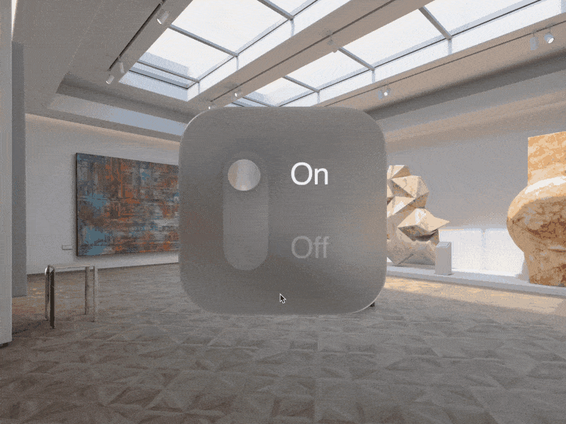
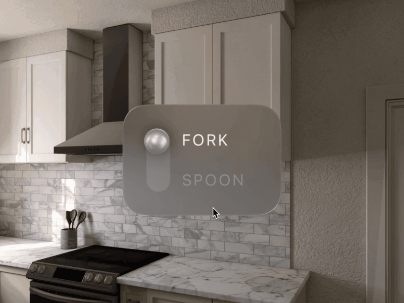
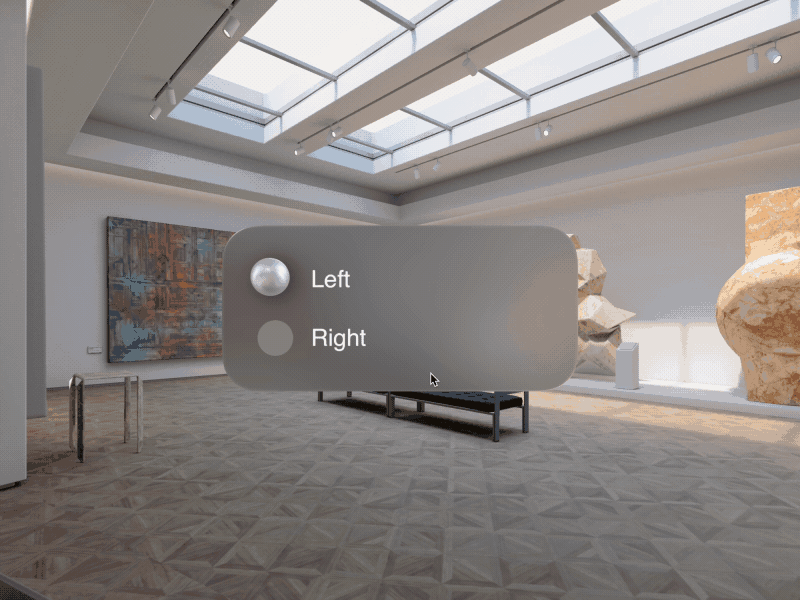

# VisionOS prototypes with SwiftUI

A collection of interactive prototypes for VisionOS made with SwiftUI.

- [Switcher III](#switcher-iii)
- [Switcher II](#switcher-ii)
- [Switcher I](#switcher-i)
- [Finger Menu 2](#finger-menu-2)

## Switcher III

[Discussion]() •
[Source](https://google.com)

## Switcher II

[Discussion]() • 
[Source]()

## Switcher I

[Discussion]() • 
[Source]()